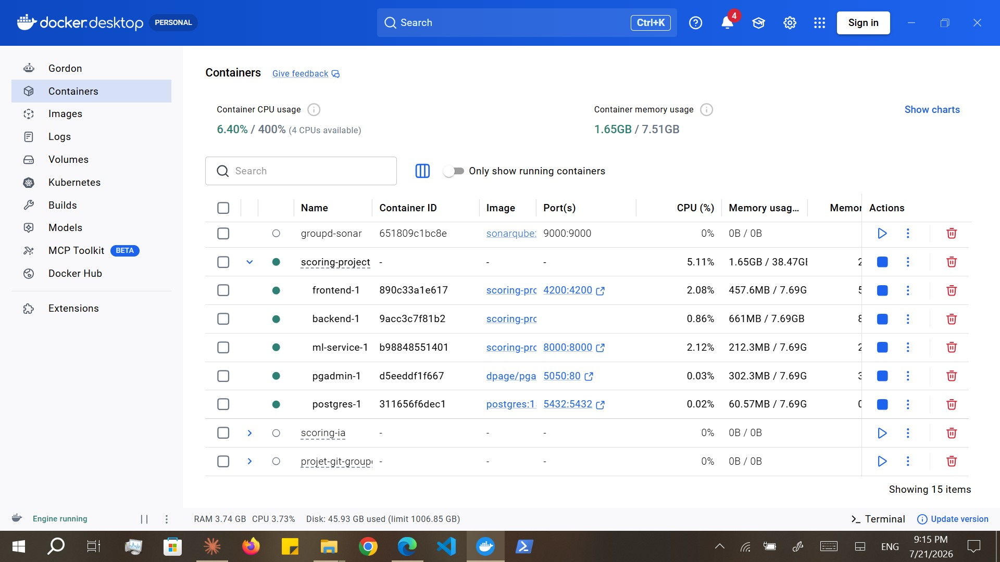

# Exécuter OScore avec Docker

Une seule commande `docker compose up` démarre l'ensemble de la plateforme **OScore** —
PostgreSQL, pgAdmin, le service de Machine Learning, le backend Spring Boot et le
frontend Angular — reliés entre eux sur le réseau par défaut de Compose.

> Nécessite **Docker Desktop** avec Compose v2 (BuildKit activé par défaut).

---

## Architecture

```
        Host browser ──► frontend  :4200 ──► backend :8080
                                                 │   │
                              JDBC :5432 ◄───────┘   └──────► ml-service :8000
                                   │                             (/predict)
                              postgres  ◄── pgadmin :5050
```

- Le **frontend** s'exécute dans votre navigateur (sur l'hôte) ; ses appels d'API visent
  donc `http://localhost:8080` — un navigateur ne peut pas résoudre les noms de services
  Docker.
- Le **backend** atteint les autres conteneurs par leur **nom de service** :
  `postgres:5432` et `ml-service:8000`.
- Le **service ML** est appelé à la demande par le backend, au moment du scoring.
- Les données PostgreSQL résident dans un volume nommé et survivent à
  `docker compose down`.

---

## Services

| Service | Image / build | URL sur l'hôte | Notes |
|---------|---------------|----------|-------|
| `postgres` | `postgres:15` | `localhost:5432` | Base `scoring_db` (utilisateur `scoring_user` / `scoring_pass`) ; healthcheck via `pg_isready` |
| `pgadmin` | `dpage/pgadmin4` | http://localhost:5050 | `admin@admin.com` / `admin` ; `scoring_db` pré-enregistrée |
| `ml-service` | `ml-service/Dockerfile.dev` | http://localhost:8000 | FastAPI + XGBoost + SHAP ; uvicorn `--reload` |
| `backend` | `backend/scoring-backend/Dockerfile.dev` | http://localhost:8080 | Spring Boot ; migrations Flyway au démarrage ; DevTools |
| `frontend` | `frontend/scoring-frontend/Dockerfile.dev` | http://localhost:4200 | Serveur de développement Angular avec rechargement à chaud |

L'ordre de démarrage est imposé par `depends_on` + healthchecks : `postgres` (sain) →
`backend` ; `ml-service` (démarré) → `backend` ; `backend` (démarré) → `frontend`.



*Figure — Les cinq conteneurs d'OScore en cours d'exécution sous Docker Compose (frontend, backend, ml-service, postgres, pgadmin).*

---

## Réseau Docker

- Tous les services partagent le réseau bridge par défaut de Compose et se résolvent
  mutuellement par **nom de service** (`postgres`, `ml-service`, `backend`).
- Seuls les ports listés ci-dessus sont publiés sur l'hôte.
- Le CORS du backend autorise l'origine du frontend `http://localhost:4200`.

---

## Démarrage

```bash
docker compose up              # build (first time) + start, logs in foreground
docker compose up -d           # detached
docker compose up --build      # force image rebuild, then start
```

Le premier lancement est lent : l'image ML installe xgboost/shap/scikit-learn et le
backend télécharge ses dépendances Maven dans un volume de cache. Les lancements suivants
sont rapides.

Vérifier l'état / les logs :

```bash
docker compose ps
docker compose logs -f backend       # follow one service
docker compose logs -f               # follow everything
```

---

## Arrêt

```bash
docker compose stop            # stop containers, keep them
docker compose down            # stop & remove containers (DB volume preserved)
docker compose down -v         # ALSO delete volumes (⚠️ wipes the database)
```

---

## Reconstruction (rebuild)

```bash
docker compose build backend               # rebuild one image
docker compose up -d --build backend       # rebuild + restart one service
docker compose build                       # rebuild all
docker compose up -d --build               # rebuild all + restart
```

### Appliquer des changements de code backend (développement)

Le backend s'exécute via `mvn spring-boot:run` avec **spring-boot-devtools**. Le code
source est monté (bind-mount), mais rien ne recompile les `.java` dans le conteneur
automatiquement ; il faut donc déclencher une compilation une fois — DevTools effectue
ensuite un redémarrage à chaud en ~3 s :

```bash
docker compose exec backend mvn compile
```

Modifier `pom.xml` (dépendances) impose un redémarrage complet :
`docker compose restart backend`. Le **frontend** et le **service ML** se rechargent à
chaud à l'enregistrement, sans étape supplémentaire.

---

## Volumes

| Volume | Rôle |
|--------|---------|
| `postgres_data` | Données PostgreSQL — **conservées** lors d'un `down` ; seul `down -v` les supprime |
| `pgadmin_data` | Paramètres pgAdmin / serveurs enregistrés |
| `maven_repo` | Cache des dépendances Maven du backend (survit aux rebuilds) |
| `frontend_node_modules` | `node_modules` construits sous Linux (isolés de la copie de l'hôte) |
| `frontend_angular_cache` | Cache de build Angular |

> Ne renommez pas le dossier du projet — Compose en dérive les noms de volumes ; un
> renommage rendrait orphelin votre `postgres_data` existant.

---

## pgAdmin

Ouvrez http://localhost:5050 et connectez-vous avec `admin@admin.com` / `admin`. Le
serveur `scoring_db` est pré-enregistré (`pgadmin/servers.json`) ; à la première connexion,
saisissez le mot de passe de la base `scoring_pass` (pgAdmin propose de le mémoriser).

---

## Dépannage

| Symptôme | Cause probable / solution |
|---------|--------------------|
| `curl localhost:8080` refusé pendant un moment après `up` | Le backend démarre encore (le premier lancement télécharge les dépendances Maven — plusieurs minutes). Surveillez `docker compose logs -f backend`. |
| Le backend s'arrête / erreur Flyway au démarrage | Incohérence de checksum de migration. En développement, `clean-on-validation-error` reconstruit la base ; si le problème persiste, `docker compose down -v` (⚠️ efface les données) puis repartez de zéro. |
| Le frontend n'atteint pas l'API | Vérifiez que le backend est bien démarré sur `:8080` ; le frontend doit appeler `localhost`, pas `backend`. |
| `port is already allocated` | Un autre processus utilise 4200/8080/8000/5432/5050. Arrêtez-le ou changez le port publié dans `docker-compose.yml`. |
| Le service ML « unhealthy » au début | Le chargement du modèle + de l'explainer SHAP prend quelques secondes (le healthcheck dispose d'une période de grâce au démarrage). |
| Un changement de code backend n'est pas pris en compte | Lancez `docker compose exec backend mvn compile` (DevTools redémarre ensuite). |
| Démon Docker injoignable | Démarrez Docker Desktop et attendez le moteur avant `docker compose up`. |
